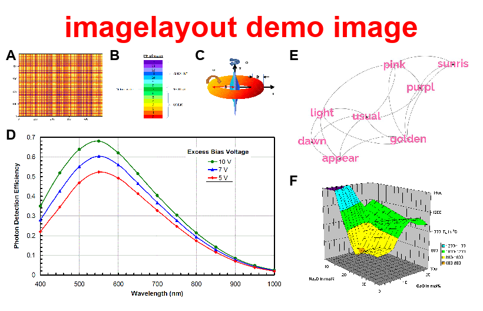

# imagelayout

**imagelayout.py** arranges several images according to a predefined
layout and produces a larger image consisting of the sub-images. It
can optionally label the individual images. Additional features
include the ability to crop and add borders to the images, to add a
border and a title to the final image, and to add arbitrary labels and
lines or arrows to the final image.

**imagelayout.py** can use any image format known to the Python PIL
module. This includes JPG, GIF, PNG, TIF, BMP, and lots of other
formats.

## PURPOSE

The intended use of **imagelayout.py** is the automated creation of
figures from sub-figures for articles and science publications.
**imagelayout.py** is a command-line Python application guided by a
configuration file; it has no graphical interface or interactive
features. Thus, it is suitable for use in scripts, Makefiles, and
automated and reproducible workflows. Instead of manually creating the
illustration in a visual image editor, you can write a simple
configuration file and generate the illustration with a single
command. Whenever one of the input images changes, simply rerun the
program and the illustration is immediately re-generated, saving you
from again starting up an image editor and doing the manual work
again.

## REQUIREMENTS

**imagelayout.py** runs under Python 3.x, and needs
[PyYAML](https://pypi.org/project/PyYAML/) and
[Pillow](https://pypi.org/project/Pillow/) to be installed.

## INSTALLATION

Put `imagelayout.py` somewhere in your path and make it executable.
If on Linux/Unix, put the man page
[`imagelayout.py.1`](docs/imagelayout.py.1) in your MANPATH, e.g.
`/usr/local/man/man1`.

## DOCUMENTATION

See the [man page](docs/manu.md) for detailed instructions.

## DEVELOPING THE CONFIGURATION FILE

The configuration file uses the YAML format which is an intuitive,
human-readable language, easily written manually. See the [man
page](docs/manu.md) for a detailed specification of the configuration file.
A quick introduction to the general YAML syntax can be found
[here](https://github.com/darvid/trine/wiki/YAML-Primer).

A [template configuration file](config_template.yaml) is available; it
demonstrates the available options, and can be used as a start to develop 
your own configuration file.

To facilitate the writing of the configuration file,
**imagelayout.py** also has a "watch" mode (`-w` option) which
monitors the configuration file and immediately regenerates the output
image when it detects a change in the configuration file (i.e. you
save it from an editor). Combined with an image viewer that also
monitors the output image for changes and immediately displays the
changed file, **imagelayout.py** can be used semi-interactively.

## DEFINING THE LAYOUT

**imagelayout.py** constructs the output image by joining some input
images horizontally or vertically (`hjoin` and `vjoin` keywords), and
then again combining the resulting images horizontally or vertically,
etc. Thus, the layout is specified as an arbitrarily nested list of
`hjoin`/`vjoin` lists. During joining, all images are resized
(upscaled) to match the highest image in height (for horizontal
joining) or the widest image in width (for vertical joining). 

If the `fixedsize` option is used for an image, padding will be used
for that image instead of resizing. When `fixedsize` is used for
several images, the relative size of those images will be retained in
the final image. This is useful e.g. to avoid font sizes becoming
different when images containing text are combined.

More details on how to specify the layout can be found in the [man
page](docs/manu.md).

## EXAMPLE

A simple example of how **imagelayout.py** works can be found in the
[demo](demo) directory. Here, 6 input images are combined and labeled
from A to F, and a title is added. The layout is defined as

```
layout:
  hjoin:
    - vjoin:
      - hjoin: [A, B, C]
      - D
    - vjoin: [E, F]
```

Thus, A, B, and C are joined horizontally, then joined with D
vertically; this is then joined horizontally with the vertically
joined E and F. The result is: 



The full configuration file is
[imagelayout_demo.yaml](demo/imagelayout_demo.yaml).

## IMAGE GRID

To create a grid of images, either horizontally joined images should
be joined vertically:

```
layout:
  vjoin:
    - hjoin: [A, B, C]
    - hjoin: [D, E, F]
    - hjoin: [G, H, I]
```

or the other way around:

```
layout:
  hjoin:
    - vjoin: [A, D, G]
    - vjoin: [B, E, H]
    - vjoin: [C, F, I]
```

## SINGLE-IMAGE USE

Although the main purpose of **imagelayout.py** is to combine multiple
images, it can also be used as a quick way to resize, crop/autocrop,
add borders, labels, lines or arrows to single images. If only a
single input image is specified, the layout does not have to be
specified, but all the other functions are available.

## SHEBANG TRICK

On Unix-based systems, you can write the `#!/usr/bin/env
imagelayout.py` line as the first line of the configuration file, and
make the file executable. Then you can execute the configuration file
as a command.
